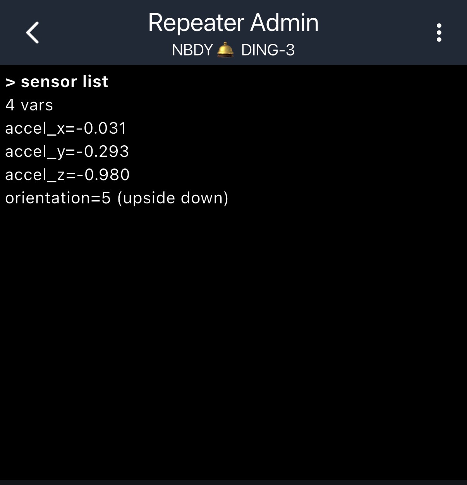

# MeshCore — RAK 1W / RAK4631 Repeater with RAK12032 Accelerometer + Calibration

A fork of [MeshCore](https://github.com/meshcore-dev/MeshCore) that adds 3-axis
accelerometer support (orientation + a `calibrate accel` command) to WisBlock repeater
builds, so you can tell how a node is sitting — and detect if it has been knocked over —
straight from the **Repeater Admin** console in the MeshCore app (or over USB serial).



## Supported boards

All accelerometer code is shared and board-agnostic (gated behind `ENV_INCLUDE_RAK12032`),
so every accel build below has the **identical** feature set: `sensor get accel_*`,
`sensor get orientation`, and the rotation-based `calibrate accel` (persisted across reboot).

| PlatformIO env | Core MCU | LoRa | Accelerometer | Notes |
|----------------|----------|------|:-------------:|-------|
| **`RAK_3401_repeater`** | RAK3401 (nRF52840) | RAK13302 (SX1262 + SKY66122, up to **1W**) | ✅ RAK12032 | The 1W repeater build |
| **`RAK_4631_repeater_accel`** | RAK4631 (nRF52840) | onboard SX1262 | ✅ RAK12032 | RAK4631 repeater **with** the accelerometer mods |

> Want the accelerometer on another nRF52 WisBlock variant? Add an env that sets
> `-D ENV_INCLUDE_RAK12032=1` and pulls in `sparkfun/SparkFun ADXL313 Arduino Library`,
> mirroring `RAK_4631_repeater_accel` in `variants/rak4631/platformio.ini`. No source changes
> needed — the feature is already in the shared code.

### Accelerometer hardware

| Part | Detail |
|------|--------|
| **RAK12032** (Analog Devices **ADXL313**) | 3-axis accelerometer, I2C address `0x1D`, on the WisBlock **SENSOR** slot (primary I2C, pins 13/14), ±2g range |

## Install

Requires [PlatformIO](https://platformio.org/) (`pip install platformio` or the VS Code
extension).

```sh
# RAK3401 1W repeater (with accelerometer)
pio run -e RAK_3401_repeater

# RAK4631 repeater (with accelerometer)
pio run -e RAK_4631_repeater_accel
```

The build produces `.pio/build/<env>/firmware.zip` (a Nordic DFU package).

### Flash (nRF52840 DFU)

Pick either method. Put the board into the bootloader first if needed (**double-tap the
reset button** — the LED pulses).

- **Web flasher (easiest):** open <https://flasher.meshcore.io>, connect over USB, and
  upload the `firmware.zip` from `.pio/build/<env>/`.
- **CLI:**
  ```sh
  adafruit-nrfutil dfu serial -pkg .pio/build/<env>/firmware.zip -p <port> -b 115200 -t 1200
  ```
  (`adafruit-nrfutil` ships bundled with PlatformIO at
  `~/.platformio/packages/tool-adafruit-nrfutil/adafruit-nrfutil.py`; the macOS port is
  typically `/dev/cu.usbmodem*`.)

At boot the USB serial log should print `Found sensor RAK12032 (ADXL313) at address: 1D`.
If it prints "was not found", the module is on a different I2C bus — see *Troubleshooting*.

## Reading orientation

Send these from the app's **Repeater Admin** console (log in with the admin password) or
over USB serial (`pio device monitor -e <env> -b 115200`):

| Command | Example reply |
|---------|---------------|
| `sensor list` | all four values at once |
| `sensor get accel_x` | `> -0.031` |
| `sensor get accel_y` | `> -0.293` |
| `sensor get accel_z` | `> 0.980` |
| `sensor get orientation` | `> 5 (upside down)` |

`accel_x/y/z` are in **g** (gravity ≈ ±1.0 on whichever axis points up/down).

### Orientation codes

Relative to the board lying flat (or to the calibrated pose — see below):

| Code | Meaning |
|------|---------|
| 0 | straight up (flat) |
| 1 | left side |
| 2 | right side |
| 3 | forward |
| 4 | back |
| 5 | upside down |
| 255 | in-between (tilted between faces) |

## Calibration — `calibrate accel`

Mounting tilt (or simply not knowing which way the board faces in its enclosure) can make
"straight up" read wrong. `calibrate accel` captures the **current pose as the reference**
and rotates all readings into that frame.

```
calibrate accel        →  OK - accel calibrated (ref 0.012,-0.044,0.998)
```

- Run it while the node is **still**, in whatever pose you want to treat as "straight up".
  Usually that means resting flat — but any pose works (calibrate it sitting on its
  "forward" face and that face becomes straight-up; the old flat pose then reads `back`).
- It uses a **rotation reference frame**, not a per-axis offset, so the gravity magnitude
  always stays ~1g and orientation stays correct in every pose.
- The calibration is **saved to flash** and re-applied automatically on every boot.
- To reset/redo, just run `calibrate accel` again in the desired pose (re-calibrating flat
  effectively clears any prior rotation).

## Telemetry note

MeshCore telemetry is transported as **Cayenne LPP**, a binary numeric-only format, and the
MeshCore app's telemetry view renders only a fixed subset of LPP types (temperature, humidity,
pressure, voltage, current, battery). The raw LPP **accelerometer** (type 113) and
**digital-input** types are not rendered, so accelerometer data does not appear in the normal
telemetry view. This feature therefore surfaces the readings through the **`sensor` CLI**, which
is the reliable readout. For completeness the firmware also emits the values on telemetry
channels 2–5 encoded as `temperature` (ch2=X, ch3=Y, ch4=Z, ch5=orientation code) in case a
future app build renders extra channels.

## Changes from upstream

- `variants/rak3401/platformio.ini` — the `RAK_3401_repeater` env enables
  `ENV_INCLUDE_RAK12032` and pulls in the `SparkFun ADXL313 Arduino Library`.
- `variants/rak4631/platformio.ini` — adds the `RAK_4631_repeater_accel` env (same accel
  flag + library) without touching the stock `RAK_4631_repeater`.
- `src/helpers/sensors/EnvironmentSensorManager.{h,cpp}` — detects the ADXL313 at `0x1D`
  (±2g), rotates readings into the calibrated frame, computes orientation, exposes
  `accel_x/y/z` + `orientation` via the `sensor` CLI, and emits the values in telemetry.
- `src/helpers/SensorManager.h`, `src/helpers/CommonCLI.{h,cpp}`,
  `examples/simple_repeater/MyMesh.cpp` — the `calibrate accel` command plus persistent
  calibration storage (in `NodePrefs`, re-applied on boot).

## Troubleshooting

- **"RAK12032 was not found at I2C address 1D"** — the module is on a non-standard bus. Add
  `-D ENV_PIN_SDA=24 -D ENV_PIN_SCL=25` to your env's `build_flags` to move it to the
  secondary I2C (Wire1), then rebuild.
- **A horizontal direction (left/right/forward/back) is wrong for your mounting** — the axis
  → direction mapping depends on physical mounting. Either run `calibrate accel` in the pose
  you want as "up", or flip the signs/cases in `accelOrientationCode()`.

---

Based on MeshCore (repeater-v1.15.0). For the full MeshCore project, docs, and licensing,
see the [upstream repository](https://github.com/meshcore-dev/MeshCore).
